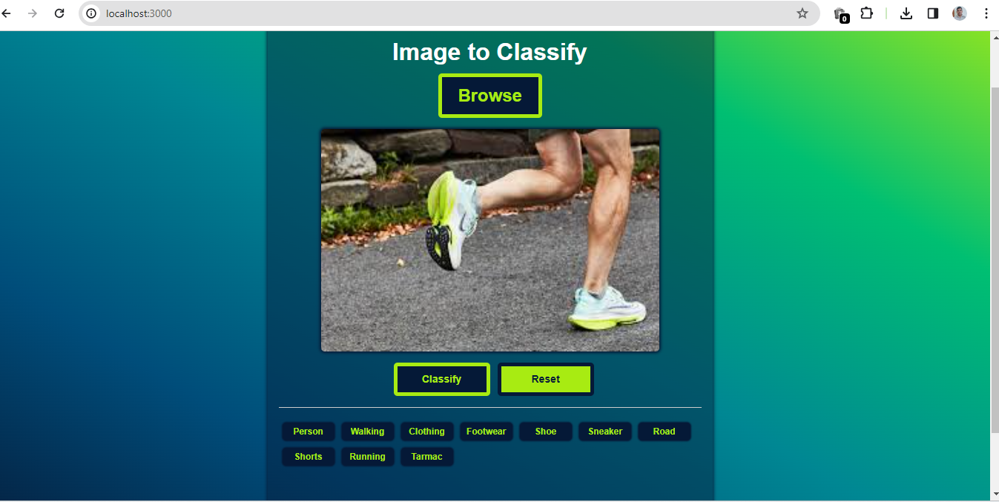

# Node Vision

This is a ExpressJS application that provides the framework on top of which you can implement multiple backends to detect labels in images.

## What you will be implementing?

You will be implementing a backend to detect label in images using _AWS Rekognition_ API.

## How to run the code

- You need to have _NodeJS 10.x or higher_ installed
- Get the code and extract it to any directory in your system
- Switch to that directory in command prompt
- Open any editor and fill your AWS credentials in .env file
- Run `npm install` to install all dependencies
- Run the app with `npm start`

## Sample

